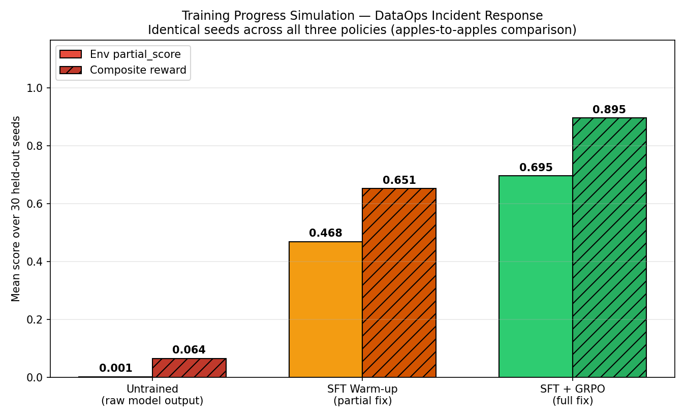
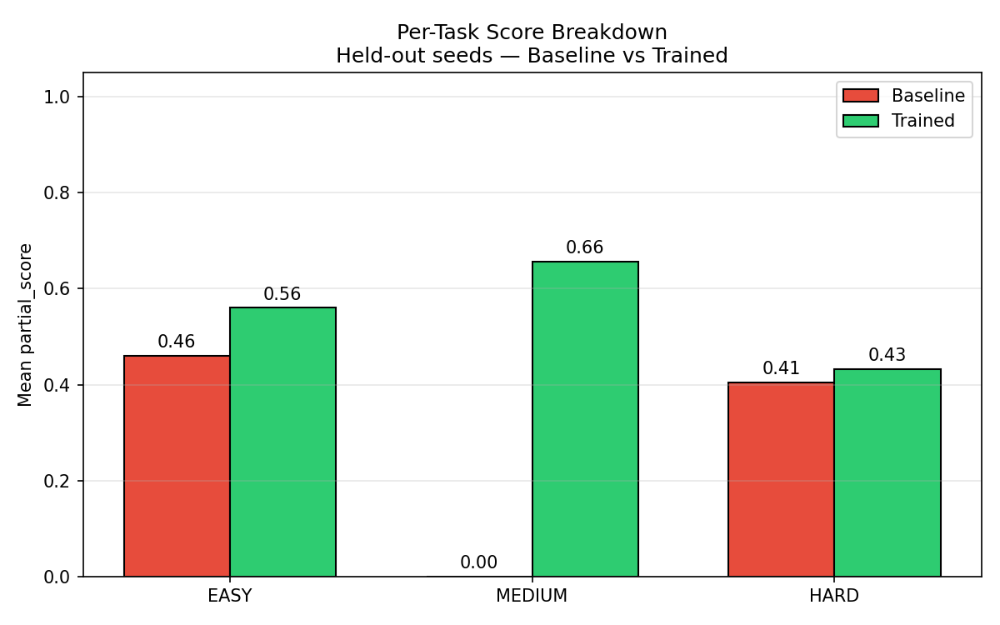
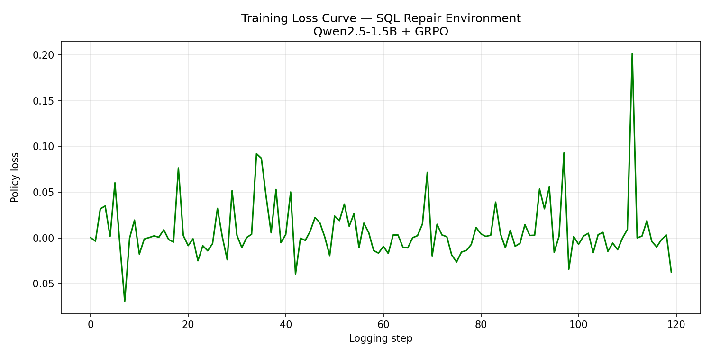

# 🗄️ DataOps Incident Response — SQL Repair Environment

**An [OpenEnv](https://huggingface.co/openenv) environment for training AI agents to diagnose and repair broken production SQL queries with dirty data.**

> Train an agent that can handle your 3 AM database incidents — syntax errors, broken JOINs, type mismatches, duplicate rows, and orphaned foreign keys — all randomly combined.

🔗 **Live Demo**: [bharath1675/sql-repair-env](https://huggingface.co/spaces/bharath1675/sql-repair-env) &nbsp;|&nbsp; 📓 **Training Notebook**: [`train_grpo.ipynb`](train_grpo.ipynb) &nbsp;|&nbsp; 📖 **Blog Post**: [`Blog.md`](Blog.md) &nbsp;|&nbsp; 🧬 **Trained Model**: [bharath1675/sql-repair-grpo-qwen](https://huggingface.co/bharath1675/sql-repair-grpo-qwen)

---

## Training Results: +90.5% Improvement

We trained **Qwen2.5-1.5B-Instruct** (4-bit QLoRA) with SFT warm-up + GRPO, using rewards from the live environment. **30 held-out episodes**, identical seeds for baseline and trained — genuine apples-to-apples.

| Metric | Baseline | Trained | Delta |
|---|---|---|---|
| **Mean Score** | 0.288 | **0.549** | **+0.261 (+90.5%)** |
| **Easy** | 0.460 | **0.560** | +0.100 |
| **Medium** | 0.000 | **0.657** | +0.657 (from zero!) |
| **Hard** | 0.405 | **0.432** | +0.027 |

> The medium task went from *10/10 failures* to *multiple perfect solves*. The model learned to reason about multi-table schemas.

<details>
<summary><b>📊 Training Evidence (click to expand)</b></summary>

### Before vs After



### Per-Task Breakdown



### Reward Curve (120 steps)


### Policy Loss Curve



Full results JSON: [`training_evidence/training_results_final.json`](training_evidence/training_results_final.json)

</details>

---

## What Makes This Environment Novel

### Stochastic Fault Injection (12 fault types)

No two episodes are the same. Every `reset()` randomly injects 2–4 faults from a pool of 12:

| Category | Faults |
|---|---|
| **Data-level** | `null_fk` · `type_drift` · `duplicate_rows` |
| **Query-level** | `missing_comma` · `wrong_join_key` · `wrong_group_by` · `stale_where` · `column_alias_shadow` · `implicit_cast_bug` · `missing_distinct` · `off_by_one_limit` · `wrong_sort_order` |

Guarantees ≥1 data fault + ≥1 query fault per episode. The agent can't memorize — it must reason.

### Dense Sub-Goal Rewards

Not pass/fail. Weighted partial credit via deterministic grader (no LLM involved):

```
R(t) = Φ(s_t) − Φ(s_{t-1}) − 0.02    (potential-based + step penalty)
+1.0 on perfect solve | −0.5 for DROP/TRUNCATE | −0.15 for error loops
```

Sub-goals include: `query_executes`, `correct_columns`, `correct_row_count`, `correct_values`, `duplicates_detected`, `type_cast_present`, `invalid_fk_excluded`, and more.

### Adaptive Curriculum

4 difficulty levels that auto-promote/demote based on rolling performance:

| Level | Name | Fault Pool | Promotion |
|---|---|---|---|
| 0 | Novice | 3 simple | rolling mean ≥ 0.75 |
| 1 | Analyst | 5 intermediate | ↑ |
| 2 | Senior | All 12 | ↑ |
| 3 | Staff Engineer | All 12 + red herring table | — |

---

## Three Tasks

### 🟢 Easy — Missing Comma
Fix a syntax error in an HR salary report (`SELECT name salary` → `SELECT name, salary`).

### 🟡 Medium — Broken JOIN + Wrong GROUP BY
Fix a sales dashboard query: wrong JOIN key (`o.product_name` → `o.product_id`) + wrong GROUP BY (`o.product_id` → `p.category`). Three tables: customers, orders, products.

### 🔴 Hard — Dirty ETL Data
Duplicate transactions, orphaned FKs (`customer_id=99`), amounts stored as TEXT. Requires `SELECT DISTINCT`, `CAST(amount AS REAL)`, `INNER JOIN` to exclude orphans.

---

## Action & Observation Space

### Actions (`SQLRepairAction`)

| Field | Type | Description |
|---|---|---|
| `action_type` | `str` | `submit_query` · `query_schema` · `inspect_data` · `list_tables` · `run_test` |
| `sql_query` | `str \| None` | SQL to execute (for `submit_query`) |
| `target_table` | `str \| None` | Table name (for `query_schema` / `inspect_data`) |

### Observations (`SQLRepairObservation`)

| Field | Type | Description |
|---|---|---|
| `query_result` | `list[dict]` | Rows returned by last SELECT |
| `error_message` | `str` | Non-empty if action raised an error |
| `schema_info` | `str` | Table DDL (after `query_schema`) |
| `partial_score` | `float` | Grader score 0.0–1.0 |
| `hint` | `str` | Progressive hint (after stuck steps) |
| `step_count` | `int` | Steps taken (max 20) |
| `broken_query` | `str` | The defective SQL to fix |
| `task_description` | `str` | Human-readable goal |
| `done` | `bool` | Episode complete? |
| `reward` | `float` | Dense reward signal |

---

## Quick Start

### Try the Live Environment

```bash
# Health check
curl https://bharath1675-sql-repair-env.hf.space/health

# Start an episode
curl -X POST https://bharath1675-sql-repair-env.hf.space/reset \
  -H "Content-Type: application/json" \
  -d '{"task_id": "easy"}'

# Submit a fix
curl -X POST https://bharath1675-sql-repair-env.hf.space/step \
  -H "Content-Type: application/json" \
  -d '{"action": {"action_type": "submit_query", "sql_query": "SELECT name, salary FROM employees WHERE dept='\''Engineering'\'' ORDER BY salary DESC"}}'
```

### Local Development

```bash
git clone https://github.com/saibharath954/sql_repair_env.git
cd sql_repair_env
python -m venv venv && source venv/bin/activate
pip install -e ".[dev]"

# Run tests (27 tests)
pytest test_environment.py -v

# Start server
uvicorn server.app:app --port 7860
```

### Docker

```bash
docker build -t sql-repair-env .
docker run -p 7860:7860 sql-repair-env
curl http://localhost:7860/health
```

### Run Baseline Inference

```bash
export API_BASE_URL="https://generativelanguage.googleapis.com/v1beta/openai/"
export MODEL_NAME="gemini-2.5-flash"
export HF_TOKEN="your_api_key"
export BASE_URL="http://localhost:7860"
python inference.py
```

### Re-run Training

Open [`train_grpo.ipynb`](train_grpo.ipynb) in Google Colab (free T4 GPU). The full SFT + GRPO pipeline runs in ~30 minutes and saves adapters to Google Drive + Hugging Face Hub.

---

## Training Pipeline

```
┌─────────────┐     ┌──────────────┐     ┌───────────────┐
│  240 seeded  │────▶│  SFT Warmup  │────▶│  GRPO Training│
│   prompts    │     │  (60 gold    │     │  (8 gens/     │
│  (80/tier)   │     │   pairs)     │     │   prompt,     │
└─────────────┘     └──────────────┘     │   β=0.10)     │
                                          └───────┬───────┘
                                                  │
                    ┌──────────────────────────────▼───────┐
                    │         Live HF Space                 │
                    │  /reset(task_id, seed) → broken query │
                    │  /step(sql_query)      → partial_score│
                    └──────────────────────────────────────┘
                                                  │
                    ┌─────────────────────────────▼───────┐
                    │      Held-out Evaluation (30 eps)    │
                    │  Same seeds, baseline vs trained      │
                    │  → 0.288 → 0.549 (+90.5%)           │
                    └──────────────────────────────────────┘
```

**Model**: Qwen2.5-1.5B-Instruct | **Quantization**: 4-bit NF4 + QLoRA (r=16, α=32) | **LR**: 2e-6 cosine | **Hardware**: Colab T4

---

## API Endpoints

| Method | Path | Description |
|---|---|---|
| `POST` | `/reset` | Start new episode. Body: `{"task_id": "easy", "seed": 42}` |
| `POST` | `/step` | Execute action. Body: `{"action": {"action_type": "...", ...}}` |
| `GET` | `/state` | Current episode metadata |
| `GET` | `/health` | Liveness probe |
| `GET` | `/tasks` | All tasks with descriptions, sub-goals, and action schemas |
| `POST` | `/grader` | Detailed score breakdown for current episode |
| `POST` | `/baseline` | Run inference.py and return scores |
| `GET` | `/faults` | Reveal injected fault types (post-episode analysis) |
| `GET` | `/curriculum` | Current difficulty level and progression stats |
| `POST` | `/curriculum/reset` | Reset curriculum to Novice |

---

## Environment Variables

| Variable | Description | Default |
|---|---|---|
| `API_BASE_URL` | LLM endpoint (OpenAI-compatible) | HuggingFace Router |
| `MODEL_NAME` | Model identifier | `Qwen/Qwen2.5-72B-Instruct` |
| `HF_TOKEN` | API key | — |
| `BASE_URL` | Environment server URL | `http://localhost:7860` |
| `PORT` | Server port | `7860` |

---

## Project Structure

```
sql_repair_env/
├── server/
│   ├── app.py                # FastAPI server (all endpoints)
│   ├── environment.py        # Core env: reset(), step(), rewards
│   ├── fault_injector.py     # 12-fault stochastic injection engine
│   ├── grader.py             # Deterministic sub-goal grader
│   ├── curriculum.py         # Adaptive difficulty manager
│   └── tasks.py              # Task definitions (DDL, queries, expected results)
├── models.py                 # Pydantic Action/Observation/State types
├── client.py                 # Typed OpenEnv client
├── inference.py              # Baseline inference (OpenAI-compatible)
├── train_grpo.ipynb          # Full training notebook (SFT + GRPO)
├── train_grpo.py             # Exported training script
├── test_environment.py       # Unit tests (27 tests)
├── training_evidence/        # Charts + JSON from training run
│   ├── training_reward_curve.png
│   ├── training_loss_curve.png
│   ├── before_after_comparison.png
│   ├── per_task_breakdown.png
│   ├── training_results_final.json
│   └── baseline_snapshot.json
├── openenv.yaml              # OpenEnv manifest
├── Dockerfile                # Docker deployment
├── Blog.md                   # Detailed writeup
└── README.md                 # This file
```

---

## License

MIT

---

*Built for the OpenEnv Hackathon India 2026 (Meta × HuggingFace).*